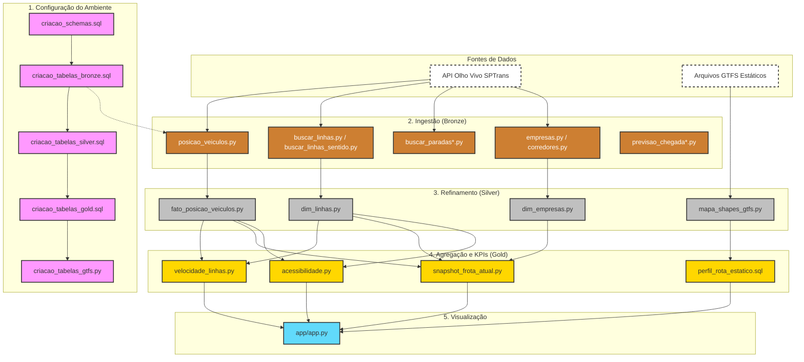

```mermaid
graph TD
    %% Definição de Estilos
    classDef config fill:#f9f,stroke:#333,stroke-width:2px;
    classDef bronze fill:#cd7f32,stroke:#333,stroke-width:2px,color:white;
    classDef silver fill:#c0c0c0,stroke:#333,stroke-width:2px;
    classDef gold fill:#ffd700,stroke:#333,stroke-width:2px;
    classDef app fill:#61dafb,stroke:#333,stroke-width:2px;
    classDef source fill:#fff,stroke:#333,stroke-width:2px,stroke-dasharray: 5 5;

    subgraph Fontes_Externas ["Fontes de Dados"]
        API_OlhoVivo["API Olho Vivo SPTrans"]:::source
        GTFS_Files["Arquivos GTFS Estáticos"]:::source
    end

    subgraph Ambiente ["1. Configuração do Ambiente"]
        Schemas["criacao_schemas.sql"]:::config
        Tab_Bronze["criacao_tabelas_bronze.sql"]:::config
        Tab_Silver["criacao_tabelas_silver.sql"]:::config
        Tab_Gold["criacao_tabelas_gold.sql"]:::config
        Tab_GTFS["criacao_tabelas_gtfs.py"]:::config
    end

    subgraph Bronze_Layer ["2. Ingestão (Bronze)"]
        direction TB
        Ingest_Posicao["posicao_veiculos.py"]:::bronze
        Ingest_Linhas["buscar_linhas.py / buscar_linhas_sentido.py"]:::bronze
        Ingest_Paradas["buscar_paradas*.py"]:::bronze
        Ingest_Empresas["empresas.py / corredores.py"]:::bronze
        Ingest_Previsao["previsao_chegada*.py"]:::bronze
    end

    subgraph Silver_Layer ["3. Refinamento (Silver)"]
        direction TB
        Fato_Posicao["fato_posicao_veiculos.py"]:::silver
        Dim_Linhas["dim_linhas.py"]:::silver
        Dim_Empresas["dim_empresas.py"]:::silver
        Mapa_Shapes["mapa_shapes_gtfs.py"]:::silver
    end

    subgraph Gold_Layer ["4. Agregação e KPIs (Gold)"]
        direction TB
        KPI_Velocidade["velocidade_linhas.py"]:::gold
        KPI_Snapshot["snapshot_frota_atual.py"]:::gold
        KPI_Acessibilidade["acessibilidade.py"]:::gold
        KPI_Rota["perfil_rota_estatico.sql"]:::gold
    end

    subgraph Visualization ["5. Visualização"]
        Streamlit_App["app/app.py"]:::app
    end

    %% Conexões
    Schemas --> Tab_Bronze --> Tab_Silver --> Tab_Gold --> Tab_GTFS
    
    API_OlhoVivo --> Ingest_Posicao
    API_OlhoVivo --> Ingest_Linhas
    API_OlhoVivo --> Ingest_Paradas
    API_OlhoVivo --> Ingest_Empresas
    
    Tab_Bronze -.-> Ingest_Posicao
    
    Ingest_Posicao --> Fato_Posicao
    Ingest_Linhas --> Dim_Linhas
    Ingest_Empresas --> Dim_Empresas
    GTFS_Files --> Mapa_Shapes
    
    Fato_Posicao & Dim_Linhas --> KPI_Velocidade
    Fato_Posicao & Dim_Linhas & Dim_Empresas --> KPI_Snapshot
    Dim_Linhas & Fato_Posicao --> KPI_Acessibilidade
    Mapa_Shapes --> KPI_Rota
    
    KPI_Velocidade --> Streamlit_App
    KPI_Snapshot --> Streamlit_App
    KPI_Rota --> Streamlit_App
    KPI_Acessibilidade --> Streamlit_App
```
