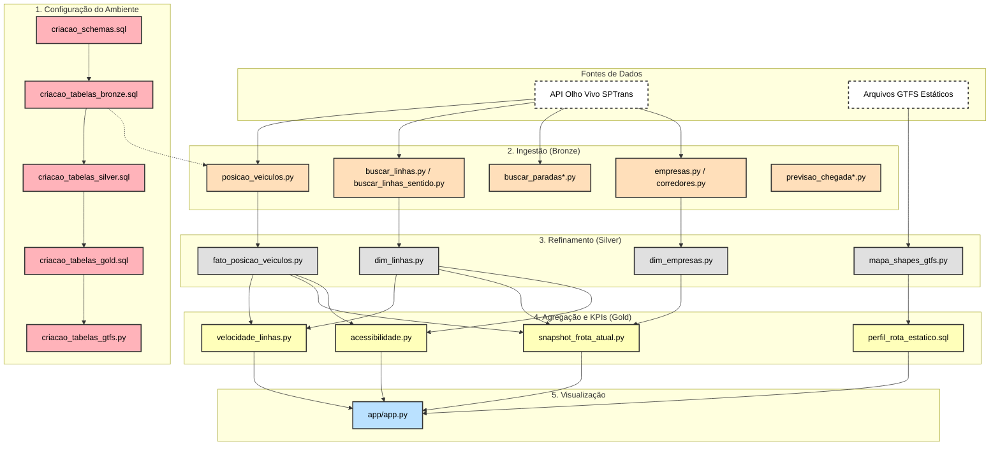

# 🚌 SPTrans Olho Vivo | Databricks Lakehouse (Standard + GTFS)


> **Pipeline de Engenharia de Dados End-to-End** para monitoramento da frota de ônibus de São Paulo. Integra dados de telemetria em tempo real (API Olho Vivo) com dados estáticos de planejamento (GTFS), processados em arquitetura Medallion (Bronze/Silver/Gold) no Databricks e visualizados em um Dashboard Streamlit com Chatbot.

---

## 🏗️ Arquitetura e Fluxo de Dados

O projeto foi desenhado para operar com **eficiência de custos**, utilizando recursos do plano Standard do Databricks na Azure.




## ⚙️ Orquestração (Databricks Workflows)

A automação do pipeline é gerenciada nativamente pelo **Databricks Workflows (Jobs)**, sem necessidade de ferramentas externas como Airflow.

| Parâmetro | Configuração |
| :--- | :--- |
| **Nome do Job** | `pipeline_olhovivo` |
| **Frequência** | A cada 15 minutos (Cron Schedule) |
| **Cluster** | Cluster All-Purpose (Standard Mode) |

### Tasks do Workflow (Execução Sequencial)

1. **`1_ing_posic_veic_bronze`**: Conecta na API e baixa o JSON raw.
2. **`2_posic_veic_silver`**: Processa, explode e limpa os dados.
3. **`3_velocidade_gold`**: Calcula a média de velocidade e tempo de viagem.
4. **`4_snapshot_mapa`**: Atualiza a última posição conhecida da frota.


## ☁️ Estratégia de Infraestrutura e Custos (FinOps)

Este projeto adota uma arquitetura otimizada para reduzir custos de nuvem e licenciamento Databricks (DBUs), ideal para ambientes de desenvolvimento e POCs.

### 1. Armazenamento (Azure Storage vs. Catalog)
> - **Dados Físicos (Parquet/Delta):** Todos os dados persistem de forma segura em um **Azure Storage Account (ADLS Gen2)**.
> - **Metadados:** Utilizamos o **Hive Metastore (Legacy)** embutido no cluster, ao invés do Unity Catalog, para evitar custos adicionais de gerenciamento e complexidade de setup em workspace Standard.


### 2. Metadados Efêmeros (Cluster-Scoped)
Como estratégia de economia, utilizamos o metastore local do cluster (banco Derby embutido).
> - ⚠️ **Comportamento:** Quando o cluster é desligado/reiniciado, os ponteiros (schemas e definições de tabelas) desaparecem da interface visual do Catalog.
> - 💾 **Persistência:** Os dados **não são perdidos**, pois estão salvos fisicamente no Azure Storage.
> - 🔄 **Recuperação:** O pipeline inclui notebooks de "Ambiente" (`criacao_schemas`, `criacao_tabelas`) que recriam os ponteiros apontando para os locais existentes no Storage (`LOCATION 'abfss://...'`) sempre que o ambiente é reiniciado.


## 🧠 Lógica de Negócio (Camadas)

### 🥉 Camada Bronze (Ingestão Raw)
> **Posições (Real-Time):** Conexão autenticada na API da SPTrans.
>
> **GTFS (Estático):** Ingestão dos arquivos `.txt` contendo shapes, paradas e viagens.

### 🥈 Camada Silver (Limpeza e Modelagem)
> **Normalização:** Flatten de JSONs complexos.
>
> **Tipagem:** Conversão de coordenadas e timestamps.
>
> **Deduplicação:** Garante unicidade dos registros de GPS.

### 🥇 Camada Gold (Inteligência)
> **Cálculo Geoespacial:** Uso da **Fórmula de Haversine** para medir a extensão real das linhas (GTFS) e cruzar com a velocidade (GPS) para estimar o tempo de viagem.
>
> **Higienização:** Filtro de linhas fantasmas (velocidade sem frota ativa) para garantir precisão no dashboard.
<br>
> ## 📂 Estrutura do Repositório

```bash
sptrans-lakehouse/
├── app/
│   └── app.py                     # 📊 Dashboard Streamlit + Chatbot
├── databricks_notebooks/
│   ├── ambiente/                  # 🛠️ Setup de Schemas (Recuperação de Metadados)
│   ├── bronze/                    # 🥉 Ingestão API -> Delta Raw
│   ├── silver/                    # 🥈 Tratamento e Normalização
│   └── gold/                      # 🥇 KPIs e Regras de Negócio
├── docs/                          # 📄 Documentação auxiliar
├── requirements.txt               # 📦 Dependências Python
└── README.md                      # 📘 Este arquivo
